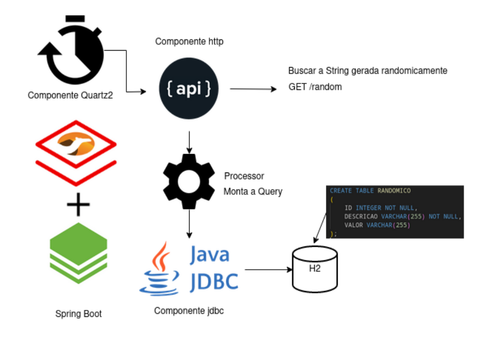

# Camel Usando Quartz, Jdbc e Http com Spring Boot

Este projeto é um exemplo utilizando os componentes camel *quartz* para de tempos em tempos buscar dados em um endpoint, o componente *http* para fazer uma chamada a um endpoint e salvar em uma base de dados, usando o componente *jdbc*. O componente *quartz* utiliza um cron para agendar a sua execução.   

## Visão Geral da Solução

Neste cenário, a aplicação irá chamar um endpoint que gera strings randomicas a cada 2 segundos e guardar em uma base H2. Criamos o endpoint que gera as Strings randômicas dentro da própria aplicação, evitando chamar algum serviço externo que possa ou não estar disponível.   

H2 é uma base relacional escrita em Java. Ela é disk-based ou in-memory.    

https://www.h2database.com/html/main.html    

**Esta solução pode ser utilizada como um solução batch.**   

## Execução local

Versão java utilizada:   
~~~
openjdk 11.0.16 2022-07-19 LTS
OpenJDK Runtime Environment (Red_Hat-11.0.16.0.8-1.el7openjdkportable) (build 11.0.16+8-LTS)
OpenJDK 64-Bit Server VM (Red_Hat-11.0.16.0.8-1.el7openjdkportable) (build 11.0.16+8-LTS, mixed mode)
~~~
   
Versão do maven utilizada:   
~~~
Apache Maven 3.8.6
~~~
   
Executando local:   
~~~
mvn spring-boot:run
~~~

## Montando a Solução no Openshift

Versão testada do Openshift: 4.13

1. Crie o projeto abaixo:

~~~
oc new-project batch
~~~

2. Crie o build da aplicação
~~~
oc new-build --binary --strategy=docker --name camel-batch -n batch
~~~

Teremos uma saída similar:
~~~
    * A Docker build using binary input will be created
      * The resulting image will be pushed to image stream tag "camel-batch:latest"
      * A binary build was created, use 'oc start-build --from-dir' to trigger a new build

--> Creating resources with label build=camel-batch ...
    imagestream.image.openshift.io "camel-batch" created
    buildconfig.build.openshift.io "camel-batch" created
--> Success
~~~ 

3. Inicie o build a aplicação

~~~
cd camel-batch-sample
oc start-build camel-batch --from-dir . -F -n batch
~~~

Teremos uma saída similar:

~~~
Uploading directory "." as binary input for the build ...

Uploading finished
build.build.openshift.io/camel-batch-1 started
Receiving source from STDIN as archive ...
time="2023-04-20T13:22:55Z" level=info msg="Not using native diff for overlay, this may cause degraded performance for building images: kernel has CONFIG_OVERLAY_FS_REDIRECT_DIR enabled"
I0420 13:22:55.898839       1 defaults.go:102] Defaulting to storage driver "overlay" with options [mountopt=metacopy=on].
Caching blobs under "/var/cache/blobs".
.....
Writing manifest to image destination
Storing signatures
Successfully pushed image-registry.openshift-image-registry.svc:5000/batch/camel-batch@sha256:30a646b48e3c567faf1b6febe5152a78533464157ac37a9241259efd80359320
Push successful
~~~ 

4. Crie a aplicação
~~~
oc new-app camel-batch -n batch
~~~

Pod criado.
~~~
oc get pods -n batch
NAME                                   READY   STATUS      RESTARTS   AGE
camel-batch-1-build                     0/1     Completed   0          8m1s
camel-batch-85d44fd56d-6dl6l            1/1     Running     0          40s
~~~

Se olharmos os logs da aplicação, poderemos ver algo como:
~~~
14:23:40.000 [DefaultQuartzScheduler-CamelBatchSample_Worker-6] INFO get-string-random - job camel sample started
14:23:40.002 [DefaultQuartzScheduler-CamelBatchSample_Worker-6] INFO com.redhat.batch.sample.SQLProcessor - String randomica: AQibZ
14:23:40.003 [DefaultQuartzScheduler-CamelBatchSample_Worker-6] INFO com.redhat.batch.sample.SQLProcessor - Query a ser executada:INSERT INTO RANDOMICO(ID, DESCRICAO, VALOR) VALUES ('14150', 'Randomico', 'AQibZ')
14:23:40.004 [DefaultQuartzScheduler-CamelBatchSample_Worker-6] INFO get-string-random - job camel sample finished
~~~

## Entendendo o código da aplicação

**CronjobCamelRoute** - Nesta classe definimos a rota camel responsável por realizar todo o processo:

Trecho
~~~
@Override
public void configure() throws Exception {
        
        from("quartz://execucaoAutomatica/processarApis?cron={{scheduler.cron.expression}}") 1
            .to("direct:processar").routeId("execucaoAutomatica");
        
        from("direct:processar").routeId("processar-dados")
            .log("job camel sample started")
            .to("{{api.random}}/random") 2
            .process(sqlProcessor).id("sql-processor") 3
            .to("jdbc:dataSource").id("jdbc-endpoint") 4
            .log("job camel sample finished");

    }
~~~

1 - Componente quartz. A parametrização do cron está no application.properties   
https://access.redhat.com/webassets/avalon/d/red_hat_integration/2022.q2/apache-camel-3.14-doc/components/3.14.x/quartz-component.html   

2 - Chamada ao componente http para a rota parametrizada api.random também no application.properties   
https://access.redhat.com/webassets/avalon/d/red_hat_integration/2022.q2/apache-camel-3.14-doc/components/3.14.x/http-component.html   

3 - Chamada ao componente SQLProcessor para montar a query com a String recebida   
   
4 - Chamada ao componente jdbc para executar a query. As configurações estão no application.properties   
https://access.redhat.com/webassets/avalon/d/red_hat_integration/2022.q2/apache-camel-3.14-doc/components/3.14.x/sql-component.html#jdbc-component.adoc   

**SQLProcessor** - Nesta classe definimos o componente SQLProcessor. Ele recebe a String randômica e monta query.

~~~
@Override
public void process(Exchange exchange) throws Exception {

    // fill up random values and generate query
    String random = exchange.getMessage().getBody(String.class);
    LOGGER.info("String randomica: "+random);
        
    String query = String.format(insertQuery, getRandomNumber(),"Randomico", random );
    LOGGER.info("Query a ser executada:"+query);
    // set query to exchange
    exchange.getIn().setBody(query);
}
~~~    

**StringRest** - Nesta classe criamos o endpoint para retornar a String randômica.
~~~    
@RestController
public class StringRest {

    @GetMapping(value = "/random")
    public String getRandomString() {
        int len = 5;
        return randomString(len);
    }

    String randomString(int len) {
        String AB = "0123456789ABCDEFGHIJKLMNOPQRSTUVWXYZabcdefghijklmnopqrstuvwxyz";
        SecureRandom rnd = new SecureRandom();
        StringBuilder sb = new StringBuilder(len);
        for (int i = 0; i < len; i++)
            sb.append(AB.charAt(rnd.nextInt(AB.length())));

        return sb.toString();
    }
}
~~~    