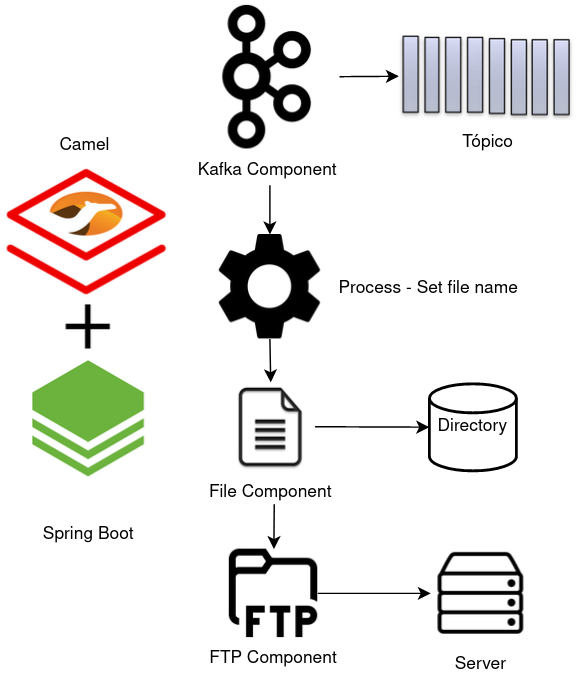

# Camel Usando Kafka, file e FTP com Spring Boot

Este projeto é um exemplo utilizando os componente camels *kafka* para buscar dados em um tópico, o componente *file* para gravar um arquivo em um diretório e por fim, o componente FTP enviar o arquivo via FTP.   

## Visão Geral da Solução

## Rodando a Solução Local

1 - Remover, se houver, os certificados e keystore antigos
~~~
rm camel-kafka-sample/ca.crt
rm camel-kafka-sample/truststore.jks
rm -r camel-kafka-sample/target
~~~

2 - Criar uma keystore adicionando o certificado do cluster (substituir o nome da secret se necessário)
~~~
cd camel-kafka-sample
oc extract -n infra-amqstreams secret/amq-streams-sample-cluster-ca-cert --keys=ca.crt --to=- > ca.crt
keytool -import -trustcacerts -alias root -file ca.crt -keystore truststore.jks -storepass password -noprompt
~~~

3 - Atualizar as configurações do kafka em camel-kafka-sample/src/main/resources/application.properties
~~~
kafka.consumer.properties.sasl.mechanism=SCRAM-SHA-512
#kafka.consumer.ssl.trust-store-location=${KAFKA_TRUSTSTORE_LOCATION:/home/jboss/truststore.jks}
kafka.consumer.ssl.trust-store-location=${KAFKA_TRUSTSTORE_LOCATION:/home/fguimara/Fernando/projects/repos/middleware/samples-camel/camel-kafka-sample/truststore.jks}
kafka.consumer.ssl.trust-store-password=${KAFKA_TRUSTSTORE_PASSWORD:password}
kafka.consumer.ssl.trust-store-type=PKCS12
kafka.consumer.properties.sasl.jaas.config=org.apache.kafka.common.security.scram.ScramLoginModule required username="${KAFKA_USER:admin}" password="${KAFKA_USER_PASSWORD:Sx52xxUiOIEQPuHA2KGLRSEkDihdoD4I}";
kafka.consumer.group-id=springboot
kafka.consumer.count=1
kafka.consumer.auto-offset-reset=earliest
topic.name.consumer=dbserver1.inventory.customers
~~~

4 - Atualizar as configurações do FTP em camel-kafka-sample/src/main/resources/application.properties (se não estiver rodando local)
~~~
## FTP Properties
ftp.server=${FTP_SERVER:localhost}
ftp.port=${FTP_SERVER_PORT:2222}
ftp.user=${FTP_USER:foo}
ftp.password=${FTP_PASSWORD:pass}
ftp.directory=${FTP_DIRECTORY:upload}
~~~

5 - Rodando um FTP local
~~~
podman run --rm -p 2222:22 atmoz/sftp foo:pass:::upload
~~~

6 - Executando local
~~~
mvn spring-boot:run
~~~

7 - Produzir um dado no tópico
~~~
mysql -u mysqluser -pmysqlpw inventory
UPDATE customers SET first_name='Anne Marie' WHERE id=1004;
UPDATE customers SET first_name='Anne' WHERE id=1004;
~~~

## Montando a Solução no Openshift

1. Crie o projeto abaixo:
~~~
oc new-project amq-camel
~~~

2. Criar o build da aplicação
~~~
oc new-build --binary --strategy=docker --name camel-kafka
~~~

Teremos uma saída similar:
~~~
    * A Docker build using binary input will be created
      * The resulting image will be pushed to image stream tag "camel-batch:latest"
      * A binary build was created, use 'oc start-build --from-dir' to trigger a new build

--> Creating resources with label build=camel-batch ...
    imagestream.image.openshift.io "camel-batch" created
    buildconfig.build.openshift.io "camel-batch" created
--> Success
~~~ 

3. Iniciar o build a aplicação
~~~
rm -r camel-kafka-sample/target
oc start-build camel-kafka --from-dir . -F
~~~

Teremos uma saída similar:

~~~
Uploading directory "." as binary input for the build ...

Uploading finished
build.build.openshift.io/camel-batch-1 started
Receiving source from STDIN as archive ...
time="2023-07-04T13:22:55Z" level=info msg="Not using native diff for overlay, this may cause degraded performance for building images: kernel has CONFIG_OVERLAY_FS_REDIRECT_DIR enabled"
I0420 13:22:55.898839       1 defaults.go:102] Defaulting to storage driver "overlay" with options [mountopt=metacopy=on].
Caching blobs under "/var/cache/blobs".
.....
Writing manifest to image destination
Storing signatures
Successfully pushed image-registry.openshift-image-registry.svc:5000/batch/camel-batch@sha256:30a646b48e3c567faf1b6febe5152a78533464157ac37a9241259efd80359320
Push successful
~~~ 

4. Criar a aplicação
~~~
oc new-app camel-kafka
~~~

Pod criado.
~~~
oc get pods
NAME                                   READY   STATUS      RESTARTS   AGE
camel-batch-1-build                     0/1     Completed   0          8m1s
camel-batch-85d44fd56d-6dl6l            1/1     Running     0          40s
~~~

Se olharmos os logs da aplicação, poderemos ver algo como:
~~~
14:23:40.000 [DefaultQuartzScheduler-camelBatchSample_Worker-6] INFO get-string-random - job camel sample started
14:23:40.002 [DefaultQuartzScheduler-camelBatchSample_Worker-6] INFO com.redhat.batch.sample.SQLProcessor - String randomica: AQibZ
14:23:40.003 [DefaultQuartzScheduler-camelBatchSample_Worker-6] INFO com.redhat.batch.sample.SQLProcessor - Query a ser executada:INSERT INTO RANDOMICO(ID, DESCRICAO, VALOR) VALUES ('14150', 'Randomico', 'AQibZ')
14:23:40.004 [DefaultQuartzScheduler-camelBatchSample_Worker-6] INFO get-string-random - job camel sample finished
~~~

## Entendendo o código da aplicação

**KafkaConsumerCamelRoute** - Nesta classe definimos a rota camel responsável por realizar todo o processo:

Trecho
~~~
@Override
public void configure() throws Exception {
    from("kafka:{{topic.name.consumer}}?brokers={{kafka.bootstrap-servers}}"+                                 1
                                       "&securityProtocol={{kafka.security.protocol}}"+
                                       "&saslMechanism={{kafka.consumer.properties.sasl.mechanism}}"+
                                       "&sslTruststoreLocation={{kafka.consumer.ssl.trust-store-location}}"+
                                       "&sslTruststorePassword={{kafka.consumer.ssl.trust-store-password}}"+
                                       "&sslTruststoreType={{kafka.consumer.ssl.trust-store-type}}"+
                                       "&saslJaasConfig={{kafka.consumer.properties.sasl.jaas.config}}"+
                                       "&groupId={{kafka.consumer.group-id}}"+
                                       "&consumersCount={{kafka.consumer.count}}"+
                                       "&autoOffsetReset={{kafka.consumer.auto-offset-reset}}")
        .routeId("KafkaConsumerCamelRoute").log("KafkaConsumerCamelRoute started")
        .process(dataProcessor).id("data-processor")                                                          2
        .log("KafkaConsumerCamelRoute file: {{file.diretory}}/${header.CamelFileName}")  
        .to("file:{{file.diretory}}")                                                                         3
        .to("sftp://{{ftp.user}}@{{ftp.server}}:{{ftp.port}}/{{ftp.directory}}?password={{ftp.password}}")    4
        .log("KafkaConsumerCamelRoute ended");
        
    }
~~~

1 - Componente kafka para consumir dados do tópico   
2 - Chamada ao componente DataProcessor para configurar o nome do Arquivo   
3 - Chamada ao componente file para criar o arquivo contendo a mensagem   
4 - Chamada ao componente sftp para enviar o arquivo ao servidor FTP   

**DataProcessor** - Nesta classe definimos o componente DataProcessor. Ele faz o log da mensagem e define o nome do arquivo a ser criado.

~~~
@Override
public void process(Exchange exchange) throws Exception {

    LOGGER.info("Dado Recebido:"+exchange.getIn().getBody());
        
    //algum processamento ou transformação
    exchange.getMessage().setHeader("CamelFileName", getRandomNumber()+".txt");

}
~~~    